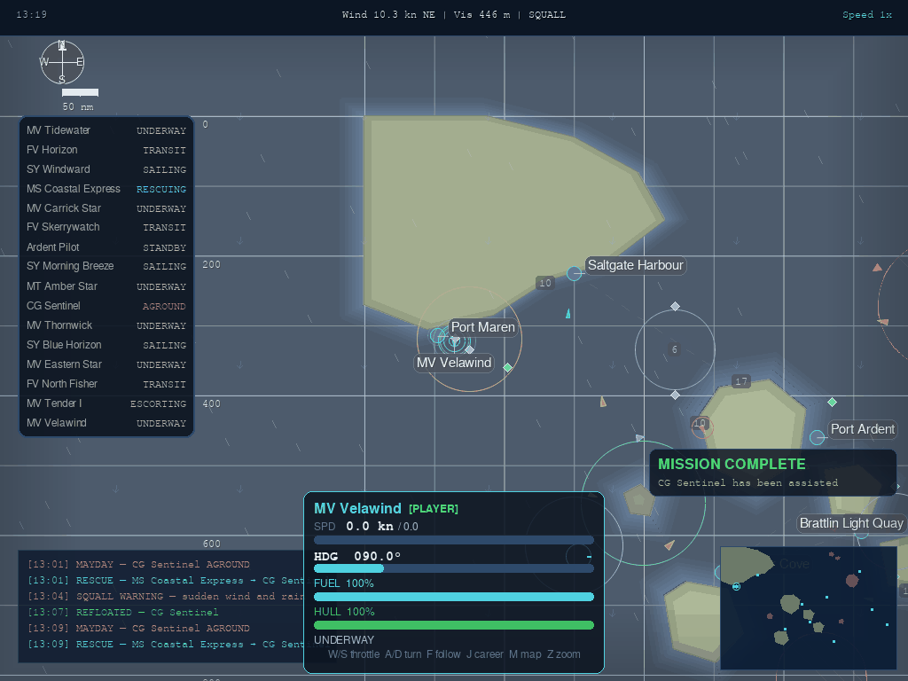
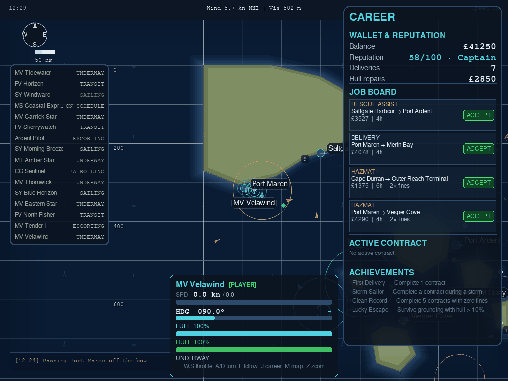
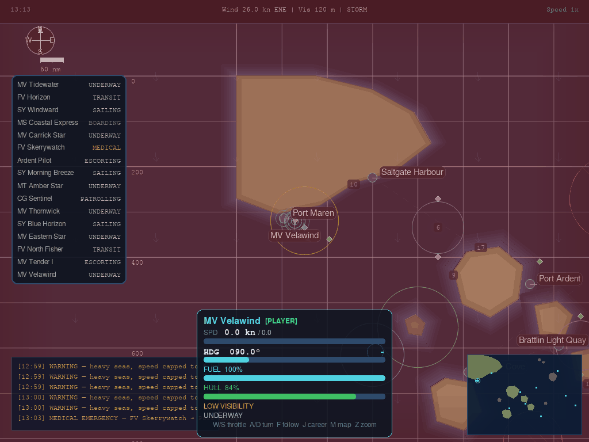

# Vela Sea

A maritime career simulator written in Python and Pygame. You command a cargo
vessel on a 210 nautical mile sea: take contracts from a job board, navigate an
ECDIS-style chart with depth soundings and restricted zones, and deal with
weather, groundings and fuel while fifteen AI vessels run their own schedules
around you. The project was built to practise simulation architecture, so the
simulation layer is pure Python with no Pygame imports and the whole game is
testable headlessly, including a bot that plays through sixteen scenarios.

**Watch it run in a browser: [velawind.github.io/vela-sea](https://velawind.github.io/vela-sea/)**
The web build is a spectator view of the same simulation, compiled to
WebAssembly with pygbag. The AI fleet, weather, tides and port traffic all run,
and you can click a vessel to follow it, pan, zoom and change time speed, but
there is no player vessel, no contracts and no sound. It takes 30 to 60 seconds
to load about 11 MB on a first visit. Playing the career game means running it
locally, as below.



## Features

- **Fifteen AI vessels** with their own routes and duty states: cargo ships,
  ferries on schedule, trawlers working the grounds, sailing yachts, a tug, a
  pilot boat and a coast guard cutter that responds to distress calls.
- **Collision avoidance** based on COLREGS Rules 14, 15 and 17, using
  closest-point-of-approach and time-to-CPA calculations, with hysteresis so
  vessels do not oscillate between manoeuvres.
- **Six contract types**: delivery, rescue assist, patrol, hazmat (double zone
  fines), passenger charter (10 knot comfort cap) and VIP charter. Four
  reputation ranks gate access: Deckhand, First Mate at 25, Captain at 50 and
  Master Mariner at 75.
- **Ten ports** with berth counts and draft limits, ten islands and eleven
  zones (no-entry areas, traffic separation schemes and speed-restricted water)
  across the sea.
- **Weather that changes gameplay**: fog cuts visibility and disables the AIS
  hover readout, squalls raise wind and rain, storms cap your speed and damage
  the hull over time.
- **Consequences**: zone fines, grounding damage, storm attrition and
  bankruptcy. Losing the hull or the wallet ends the run.
- **Navigation** by keyboard helm or right-click autopilot waypoints, with a
  world minimap and a chart showing depth shading, tide-aware soundings, zone
  boundaries and navigation marks.
- **Four achievements** and a career save written every time you dock.
- **Generated audio**: seven sound files synthesised from the standard library
  (`wave` and `struct`) rather than recorded, so the repository carries no audio
  the code cannot rebuild.

Two limits worth stating plainly. The save is career-only: money, reputation,
statistics, achievements and hull are persisted, but the active contract, world
state, weather and your position are not, so Continue restarts you at the spawn
point with your career intact. And AI vessels displaced far from their routes
have no reliable way back to them, which is the largest remaining source of AI
groundings. Both are documented with measurements in
[KNOWN_ISSUES.md](KNOWN_ISSUES.md), along with three attempted fixes for the
second that measured worse than the current behaviour and were not merged.



## Architecture

The layering rule is that simulation never draws and rendering never mutates
state. It is enforced by a simple property: nothing under `engine/`, `data/` or
`config.py` imports Pygame, which is what makes the headless test suite
possible.

```
engine/          Pure Python simulation, no Pygame
  world.py       World, Port (berths, draft limits), Island, Zone, NavMark
  ship.py        Vessel physics, fuel, route state machine, autopilot
  environment.py Weather drift, fog/squall/storm events, tide, day/night
  collision.py   COLREGS avoidance: CPA/TCPA, give-way logic, safe pathfinding
  career.py      Career state, job board, contracts, ranks, save and load
  mission.py     AI mission generation and tracking

render/          Pygame drawing, reads engine state
  camera.py      World to screen conversion, single source
  chart.py       Chart layers, vessels, weather visuals, status bar
  panels.py      HUD, career panel, docking menu, title, minimap, game over
  sound.py       Sound manager and standard-library WAV synthesis

data/world_data.py   Sea geography, ports, islands, zones and AI routes
tests/               Headless pytest suite and a 16-scenario gameplay bot
main.py              Game loop: input, fixed-timestep simulation, render
config.py            Tunable constants (251 of them)
```

Every tunable number lives in `config.py` rather than at its use site, so
balance changes are edits to one file.

`main.py` is the weakest part of the structure at 3,544 lines, and some logic
that belongs in `engine/` (search-and-rescue dispatch, AI decision helpers,
vessel spawning) currently sits in the `Game` class instead.



## Stack

Python 3.10 or newer. Pygame 2.6 is the only runtime dependency. Development
extras (pytest, PyInstaller, pygbag, Playwright) are separate.

## Running it

```bash
pip install -r requirements.txt
python main.py
```

`python main.py --skip-title` starts a session directly, which is useful during
development. No accounts, API keys or network access are needed.

### Controls

| Key or action | Effect |
|---|---|
| W / S | Throttle up and down |
| A / D | Steer to port and starboard, cancels autopilot |
| Right-click | Set an autopilot waypoint, or click a port to target it |
| F | Toggle the follow camera |
| J | Career panel and job board |
| M | Toggle the minimap |
| E | Environment settings (weather, time, sound) |
| T | Technical systems panel |
| Tab | Cycle vessel selection |
| Space | Pause, or depart when docked |
| 1 / 2 / 3 / 4 | Time speed: pause, 1x, 2x, 3x |
| Mouse drag or wheel | Pan and zoom the chart |
| Z | Reset zoom |
| R | Restart after game over |
| Esc | Quit |

Drift into a port at 2 knots or less and the port menu opens: refuel, repair the
hull, browse the job board or cast off.

## Tests

```bash
pip install -r requirements-dev.txt
pytest tests/ -q                    # 16 tests
python tests/test_bot.py            # 16 gameplay scenarios end to end
python tests/test_visual_perf.py    # per-frame render budget, machine-dependent
```

The bot drives a real `Game` instance with SDL's dummy video and audio drivers
and plays through movement, contract completion, zone fines, grounding damage,
hull failure, fuel exhaustion and coast guard dispatch, save and load round
trips, docking, autopilot, contract variety, rank thresholds, achievement
unlocks, weather effects, first-session onboarding and key rebinding. It reports
per-scenario pass or fail with enough detail to locate a failure.

`test_visual_perf.py` is a timing benchmark rather than a unit test, so it runs
only when invoked directly and is not collected by pytest.

## Builds

`vela_sea.spec` is a PyInstaller recipe for a folder-based Windows build; see
[DISTRIBUTION.md](DISTRIBUTION.md). `tools/build_web.py` produces a pygbag
WebAssembly bundle, and the deployed output is tracked in `docs/`. Audio is
disabled in the web build.

## Project documents

- [KNOWN_ISSUES.md](KNOWN_ISSUES.md): every known defect with a severity
  rating, plus the measurements behind the open design question above.
- [PLAYTEST_NOTES.md](PLAYTEST_NOTES.md): playtest findings, including the
  onboarding change that cut time to first payout from about 8 minutes to
  between 1.2 and 2.8.
- [RELEASE_NOTES.md](RELEASE_NOTES.md): version history.
- [DISTRIBUTION.md](DISTRIBUTION.md): packaging.

## Note on how this was built

Vela Sea was written with heavy use of Claude Code. The specifications, the
architecture rules, the test strategy and the decisions about what to merge are
mine, and the prompt files kept in the repository are part of that record. I am
stating this rather than leaving it to be inferred from the commit history.
